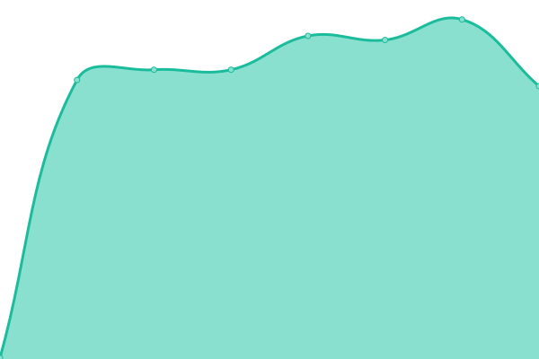
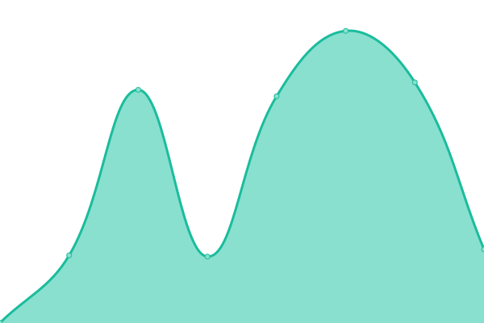
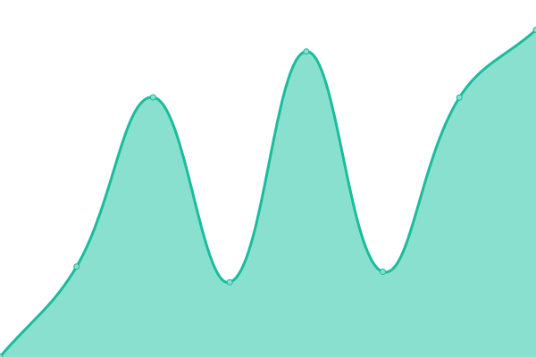
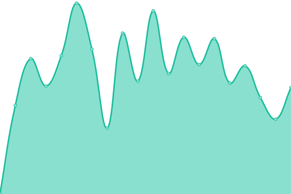
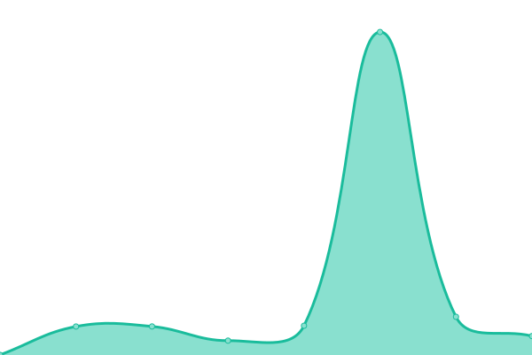
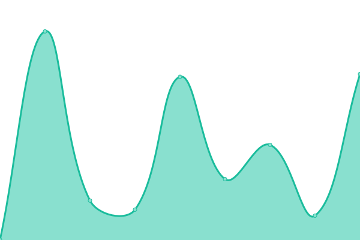
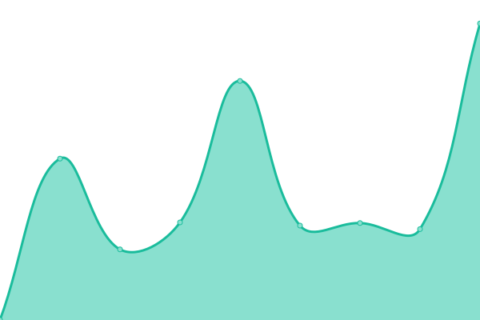
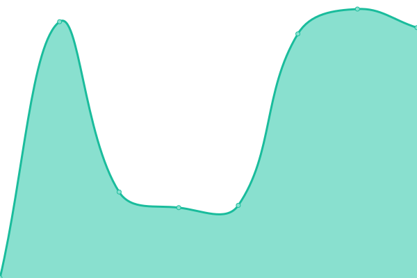
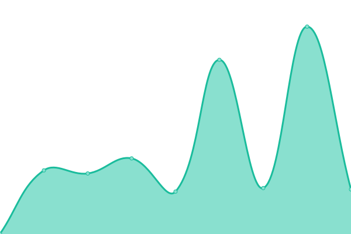
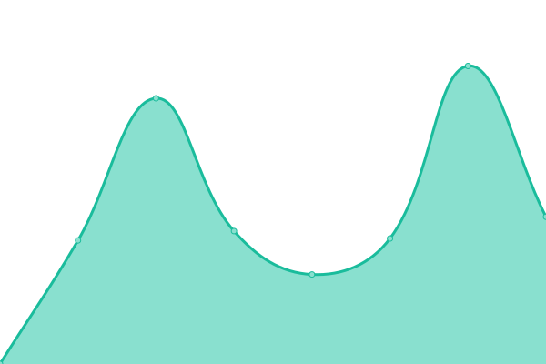

# [📈 Live Status](https://radiuszon.github.io/upptime/): <!--live status--> **🟧 Partial outage**

This repository contains the open-source uptime monitor and status page for [radiuszon](https://radiuszon.github.io/upptime/), powered by [Upptime](https://github.com/upptime/upptime).

With [Upptime](https://upptime.js.org), you can get your own unlimited and free uptime monitor and status page, powered entirely by a GitHub repository. We use [Issues](https://github.com/radiuszon/upptime/issues) as incident reports, [Actions](https://github.com/radiuszon/upptime/actions) as uptime monitors, and [Pages](https://demo.upptime.js.org) for the status page.

<!--start: status pages-->
<!-- This summary is generated by Upptime (https://github.com/upptime/upptime) -->
<!-- Do not edit this manually, your changes will be overwritten -->
<!-- prettier-ignore -->
| URL | Status | History | Response Time | Uptime |
| --- | ------ | ------- | ------------- | ------ |
|  [Workkami](https://www.workkami.com) | 🟩 Up | [workkami.yml](https://github.com/radiuszon/upptime/commits/HEAD/history/workkami.yml) | 

 365ms
     
 | 

<a href="https://radiuszon.github.io/upptime/history/workkami">100.00%</a>
    

|  [(Admin)Workkami](https://admin.workkami.com) | 🟩 Up | [admin-workkami.yml](https://github.com/radiuszon/upptime/commits/HEAD/history/admin-workkami.yml) | 

 148ms
     
 | 

<a href="https://radiuszon.github.io/upptime/history/admin-workkami">100.00%</a>
    

|  [Zon Application](https://www.zonapplication.com) | 🟩 Up | [zon-application.yml](https://github.com/radiuszon/upptime/commits/HEAD/history/zon-application.yml) | 

 127ms
     
 | 

<a href="https://radiuszon.github.io/upptime/history/zon-application">100.00%</a>
    

|  [(Admin) Zon Application](https://www.zonapplication.com/admin) | 🟩 Up | [admin-zon-application.yml](https://github.com/radiuszon/upptime/commits/HEAD/history/admin-zon-application.yml) | 

 69ms
     
 | 

<a href="https://radiuszon.github.io/upptime/history/admin-zon-application">100.00%</a>
    

|  [The Kaset](https://www.thekaset.com) | 🟩 Up | [the-kaset.yml](https://github.com/radiuszon/upptime/commits/HEAD/history/the-kaset.yml) | 

 1793ms
     
 | 

<a href="https://radiuszon.github.io/upptime/history/the-kaset">100.00%</a>
    

|  [Tonkla Shaiyo](https://www.tonklashaiyo.com) | 🟩 Up | [tonkla-shaiyo.yml](https://github.com/radiuszon/upptime/commits/HEAD/history/tonkla-shaiyo.yml) | 

 223ms
     
 | 

<a href="https://radiuszon.github.io/upptime/history/tonkla-shaiyo">100.00%</a>
    

|  [(Admin) Tonkla Shaiyo](https://admin.tonklashaiyo.com/admin/login) | 🟩 Up | [admin-tonkla-shaiyo.yml](https://github.com/radiuszon/upptime/commits/HEAD/history/admin-tonkla-shaiyo.yml) | 

 234ms
     
 | 

<a href="https://radiuszon.github.io/upptime/history/admin-tonkla-shaiyo">100.00%</a>
    

|  [ACE Carbon Ventures](https://www.acecarbonventures.com) | 🟩 Up | [ace-carbon-ventures.yml](https://github.com/radiuszon/upptime/commits/HEAD/history/ace-carbon-ventures.yml) | 

 155ms
     
 | 

<a href="https://radiuszon.github.io/upptime/history/ace-carbon-ventures">100.00%</a>
    

|  [ACE Solar](https://www.acesolar.co.th) | 🟩 Up | [ace-solar.yml](https://github.com/radiuszon/upptime/commits/HEAD/history/ace-solar.yml) | 

 141ms
     
 | 

<a href="https://radiuszon.github.io/upptime/history/ace-solar">100.00%</a>
    

|  [(Admin) ACE Solar](https://admin.acesolar.co.th) | 🟩 Up | [admin-ace-solar.yml](https://github.com/radiuszon/upptime/commits/HEAD/history/admin-ace-solar.yml) | 

 137ms
     
 | 

<a href="https://radiuszon.github.io/upptime/history/admin-ace-solar">100.00%</a>
    

|  [Triple A Hardboard](https://www.triplea-hardboard.com) | 🟩 Up | [triple-a-hardboard.yml](https://github.com/radiuszon/upptime/commits/HEAD/history/triple-a-hardboard.yml) | 

 921ms
     
 | 

<a href="https://radiuszon.github.io/upptime/history/triple-a-hardboard">100.00%</a>
    

|  [Triple A Plywood](https://www.triplea-plywood.com) | 🟩 Up | [triple-a-plywood.yml](https://github.com/radiuszon/upptime/commits/HEAD/history/triple-a-plywood.yml) | 

 1265ms
     
 | 

<a href="https://radiuszon.github.io/upptime/history/triple-a-plywood">100.00%</a>
    

|  [Woodchip](https://www.woodchip.saaa.co.th) | 🟩 Up | [woodchip.yml](https://github.com/radiuszon/upptime/commits/HEAD/history/woodchip.yml) | 

 3617ms
     
 | 

<a href="https://radiuszon.github.io/upptime/history/woodchip">98.10%</a>
    

|  [Bring Back The Forest](https://www.bringbacktheforest.org) | 🟩 Up | [bring-back-the-forest.yml](https://github.com/radiuszon/upptime/commits/HEAD/history/bring-back-the-forest.yml) | 

 421ms
     
 | 

<a href="https://radiuszon.github.io/upptime/history/bring-back-the-forest">100.00%</a>
    

|  [(Admin) Bring Back The Forest](https://admin.bringbacktheforest.org) | 🟩 Up | [admin-bring-back-the-forest.yml](https://github.com/radiuszon/upptime/commits/HEAD/history/admin-bring-back-the-forest.yml) | 

 205ms
     
 | 

<a href="https://radiuszon.github.io/upptime/history/admin-bring-back-the-forest">100.00%</a>
    

|  [GPS Tracker web](http://tracker.ace-energy.co.th/login) | 🟩 Up | [gps-tracker-web.yml](https://github.com/radiuszon/upptime/commits/HEAD/history/gps-tracker-web.yml) | 

 659ms
     
 | 

<a href="https://radiuszon.github.io/upptime/history/gps-tracker-web">100.00%</a>
    

|  [GPS Tracker API](http://tracker.ace-energy.co.th/tracker/api/v1/health) | 🟩 Up | [gps-tracker-api.yml](https://github.com/radiuszon/upptime/commits/HEAD/history/gps-tracker-api.yml) | 

 226ms
     
 | 

<a href="https://radiuszon.github.io/upptime/history/gps-tracker-api">96.92%</a>
    

|  [GPS Receiver API](http://tracker.ace-energy.co.th/receiver/api/v1/health) | 🟥 Down | [gps-receiver-api.yml](https://github.com/radiuszon/upptime/commits/HEAD/history/gps-receiver-api.yml) | 

 8123ms
     
 | 

<a href="https://radiuszon.github.io/upptime/history/gps-receiver-api">69.71%</a>
    

|  [Agro Shop API](https://feedstock.saaa.co.th/api/v1/healthz) | 🟩 Up | [agro-shop-api.yml](https://github.com/radiuszon/upptime/commits/HEAD/history/agro-shop-api.yml) | 

 144ms
     
 | 

<a href="https://radiuszon.github.io/upptime/history/agro-shop-api">98.12%</a>
    

|  [(Admin) Agro Shop](https://feedstock.saaa.co.th) | 🟩 Up | [admin-agro-shop.yml](https://github.com/radiuszon/upptime/commits/HEAD/history/admin-agro-shop.yml) | 

 41ms
     
 | 

<a href="https://radiuszon.github.io/upptime/history/admin-agro-shop">98.12%</a>
    

|  [Agro Shop](https://feedstockapp.saaa.co.th) | 🟩 Up | [agro-shop.yml](https://github.com/radiuszon/upptime/commits/HEAD/history/agro-shop.yml) | 

 342ms
     
 | 

<a href="https://radiuszon.github.io/upptime/history/agro-shop">98.10%</a>
    

<!--end: status pages-->

[**Visit our status website →**](https://radiuszon.github.io/upptime/)

## 📄 License

- Powered by: [Upptime](https://github.com/upptime/upptime)
- Code: [MIT](./LICENSE) © [radiuszon](https://demo.upptime.js.org)
- Data in the `./history` directory: [Open Database License](https://opendatacommons.org/licenses/odbl/1-0/)
